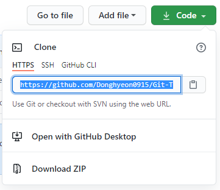
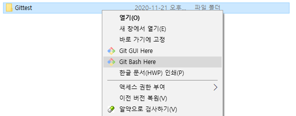
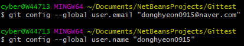
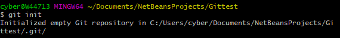
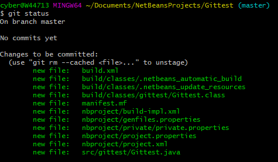
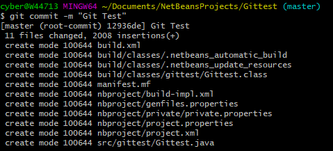
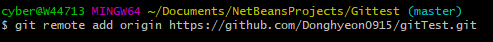
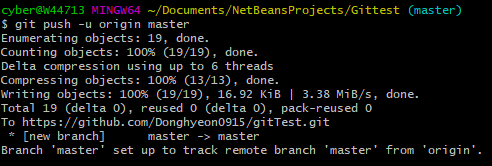

## GitHub에 프로젝트 올리기(Windows)
<hr>

#### 1. [Git 설치](https://git-scm.com/downloads)

#### 2. New Repository 생성

#### 3. Repository Url 복사
<p align = "center"></p>

#### 4. 로컬 컴퓨터에서 업로드하고 싶은 프로젝트 우클릭 > *Git Bash Here*
<p align = "center"></p>


#### 5. git cmd에서 github 로그인

``` 
  - git config --global user.email "useremail@example.com"
  - git config --global user.name "username" 
```
<p align = "center"></p>
 
#### 6. .git 파일 생성

``` 
  - git init
```
<p align = "center"></p>

#### 7. 프로젝트 Commit


```
  - git add . (or git add filename.*)
```

> **git add** 후 **git status**로 상태 확인
<p align = "center"></p>

```
  - git commit -m "Commit message"
```

<p align = "center"></p>

#### 8. 프로젝트 업로드


```
  - git remote add origin Repositoy URL
```
<p align = "center"></p>

```
  - git push -u origin master (origin master 필수)
```
<p align = "center"></p>
 
 
    
 
