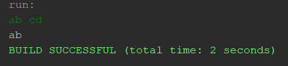
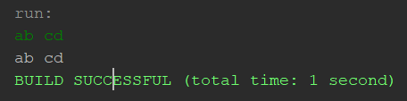

# Java 

### 자바 유용한 기능 && 기본 개념 정리

<hr>

## Java Scanner로 공백 포함한 문자열 입력받기. (useDelimiter() 메소드)

 - 일반적으로 Scanner를 통해 입력을 받을 때에는 공백을 포함할 수 없다. 
 
 ```java

public class Test {
    public static void main(String[] args) {
        Scanner scan = new Scanner(System.in);
        String input = scan.next();
        
        System.out.println(input);
    }  
}
```
#### < 실행 결과 > 


( 공백을 기준으로 입력이 끊기는 것을 볼 수 있다. )

- 일반적으로는 이를 해결하기 위해 <b>BufferedReader</b>를 써도 되지만, 아무래도 <b>BufferedReader</b>를 이용하다보면 한 줄을 통째로 읽어들이기 때문에 <b>InputMissMatchException</b> 이 발생하는 경우가 많다.

- <b>BufferedReader</b>를 쓰기 애매할 경우에 유용하게 쓰일 수 있는 Scanner 클래스의 useDelimiter() 메소드가 있다.

- <b>useDelimiter()</b>  메소드를 사용하면 원하는 구분자를 통해 입력을 구분할 수 있다.

```java
public class Test {
    public static void main(String[] args) throws IOException {
        Scanner scan = new Scanner(System.in).useDelimiter("\n"); // "\n" 가 나올 때 까지가 하나의 입력이 된다.
        String input = scan.next();
        
        System.out.println(input);
    }
}
```

#### < 실행 결과 >

(공백이 있더라도 한 줄이 모두 입력이 되는 것을 볼 수 있다.)
<br>

```java
  sc.nextLine() 메소드를 사용하면 공백을 포함해서 입력받을 수 있다.
```

<hr>

#### * 참고하면 좋은 자료 *
Subject                 |  Link
------------------ | ----------------------
static의 올바른 사용 | [Tistory](https://12bme.tistory.com/94)
자료형 성능 비교      | [Tistory](https://12bme.tistory.com/91?category=682904)
자바8 Optional 클래스 | [Tistory](https://12bme.tistory.com/469?category=682904)
자바8 스트림이란? | [Tistory](https://12bme.tistory.com/461?category=682904)
자바 이미지 텍스트 추출 ( 테서렉트 ) | [Naver Blog](https://m.blog.naver.com/PostView.nhn?blogId=ndb796&logNo=221047720286&proxyReferer=https:%2F%2Fwww.google.com%2F)
자바 이미지에서 특정 픽셀의 색상 추출 | [Naver Blog](https://m.blog.naver.com/ndb796/221047683553)
자바 외부 DB 사용하기 | [Naver Blog](https://m.blog.naver.com/ndb796/221069124984)
자바 프로그램 실행 시간 측정 | [Tistory](https://emmadeveloper.tistory.com/25)
자바 제네릭 이해하기 Part 1 | [Github](https://yaboong.github.io/java/2019/01/19/java-generics-1/)
자바 제네릭 사용법 | [Tistory](https://coding-factory.tistory.com/573)
자바 Default Method(디폴트 메소드) | [Tistory](https://siyoon210.tistory.com/95?category=839846)
자바 Optional 클래스 - Null 데이터 편하게 다루기 | [Tistory](https://siyoon210.tistory.com/91?category=839846)
자바 clone 메소드(오버라이딩해서 사용하기) | [Naver blog](https://m.blog.naver.com/PostView.nhn?blogId=highkrs&logNo=220258075471&proxyReferer=https:%2F%2Fwww.google.co.kr%2F)
